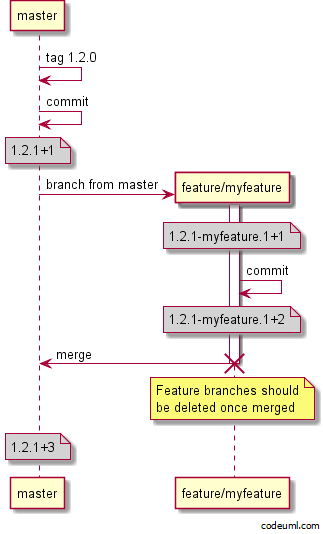

# ASP.Net API Versioning using GitVersion

Simple ASP.Net API that uses GitVersion 

## Run 
* `dotnet run`

## Call Endpoints
* `curl http://localhost:5000/helloworld -L`
* `curl https://localhost:5001/helloworld`
* `curl http://localhost:5000/info -L`
* `curl https://localhost:5001/info`

## GitVersion

GitVersion is a tool, that calculates version numbers based on the git history of a repository. You can choose different models of calculation that are aligned with the most common branching strategies. 

### Installation and usage

* Install with `choco install GitVersion.Portable` on windows or `brew install gitversion` using macos
* gitv will be placeholder in the following sections for either `gitversion` on macos or `GitVersion.exe` on windows 
* configuration is based on GitVersion.yml. We use the GitHubFlow config which is reflected as "Continuous Delivery" mode. Further descriptions are based on that fact
* invoking `gitv` shows the settings as well as the next calculated version

### General Behaviour
* Git tags can "reset" the current version settings
* All commits on master increase patch (if not already increased) number and add appendix `+<number of commits>`
* Newly created feature branches have the following format: `SemVer-<branchname>.1+<number of commits>`
* Major, Minor or Patch can be increased explicitly by adding `+semver: major`, `+semver: minor` or `+semver: patch` to a commit message

### Releases
* GitHubFlow does not need any release branch, assuming that every commit on master is deployable. 
* Release are defined on tags. If we want to craft a release we can simply create a tag on master, assuming that every commit could be a new release. 
* If there is a risk of commits on the master not being ready to be a release, it can make sense to have additional release branches where a release is finalized
* Creating a release branch (e.g. release/1.0) creates a version that has a bumped major version. Minor and Patch equal zero with an appendix of `rc.1+<number of commits>`. Note that the version after `release/` specifies the version from where GitVersion will start to calculate the next version on that branch. 
* As every commit on master only increases Patch we would have to add a final release tag on the release branch after the release is finalized. That way after merging the release branch into master, the version on master would be "reseted" to the version of the tag on the release branch



# Build and Run
* Build app using Version calculated by GitVersion 
```
dotnet build /property:Version=`gitversion /output json /showvariable SemVer`
```
* Run with `dotnet run --no-build`
